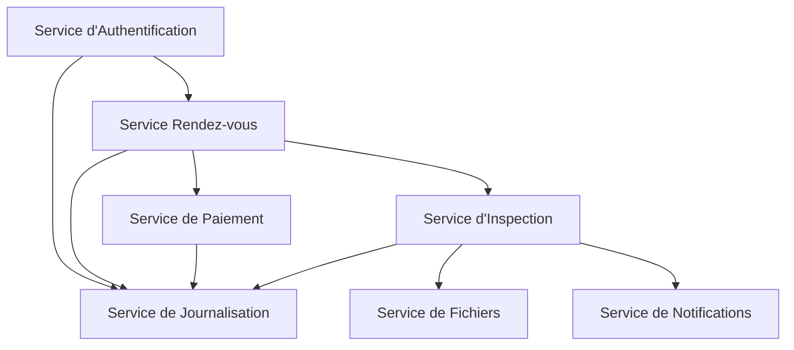

# 🚗 Système d'Inspection Automobile (SIA)

# 🚗 Système d'Inspection Automobile (SIA)

**SIA** est une solution complète de gestion des contrôles techniques des véhicules, conçue avec une architecture microservices moderne. Cette plateforme permet aux centres de contrôle technique de gérer efficacement les rendez-vous, les inspections et la documentation des véhicules, tout en offrant une expérience utilisateur optimale.

## 📌 Points clés

- 🚀 **Architecture modulaire** basée sur 7 microservices indépendants
- 🔒 **Sécurité renforcée** avec authentification JWT et rôles utilisateurs
- 📱 **Interface moderne** et réactive pour une utilisation simplifiée
- 📊 **Tableaux de bord** complets pour le suivi en temps réel
- 📄 **Génération automatique** de rapports PDF et de factures

## 📦 Versions disponibles

| Version | Statut    | Date de sortie |
|---------|-----------|----------------|
| v2.0    | Stable    | Octobre 2024   |
| v1.0    | Maintenue | Juin 2024      |

## 🎯 Fonctionnalités principales

### 🔐 Gestion des Utilisateurs
- **Authentification sécurisée** avec JWT et renouvellement de token
- **Rôles multiples** : Administrateur, Technicien, Client
- **Gestion des profils** avec mise à jour en temps réel
- **Récupération de mot de passe** sécurisée

### 📅 Gestion des Rendez-vous
- **Prise de rendez-vous en ligne** avec sélection de créneau
- **Calendrier interactif** avec disponibilité en temps réel
- **Rappels automatiques** par email/SMS
- **Annulation et modification** des rendez-vous

### 🔍 Inspection des Véhicules
- **Checklist numérique** pour les techniciens
- **Saisie rapide** avec suggestions intelligentes
- **Photos des défauts** avec annotations
- **Historique complet** des inspections

### 💳 Paiements et Facturation
- **Paiement en ligne** sécurisé
- **Génération automatique** de factures
- **Suivi des paiements** en temps réel
- **Historique des transactions**

### 📊 Tableaux de Bord
- **Vue d'ensemble** des activités
- **Statistiques** de performance
- **Rapports personnalisables**
- **Export des données** en plusieurs formats

## 🏗 Architecture Technique

### Schéma des Microservices



### Détails des Services

| Service | Port | Description |
|---------|------|-------------|
| 🔐 Authentification | 8001 | Gestion des utilisateurs et sécurité |
| 📅 Rendez-vous | 8002 | Gestion des créneaux et réservations |
| 💰 Paiement | 8003 | Traitement des transactions |
| 🔧 Inspection | 8004 | Gestion des contrôles techniques |
| 📁 Fichiers | 8005 | Stockage des documents et photos |
| 🔔 Notifications | 8006 | Envoi d'emails et SMS |
| 📊 Journalisation | 8007 | Suivi des activités système |

### Technologies Utilisées

#### Backend
- **Framework** : FastAPI (Python 3.10+)
- **Base de données** : PostgreSQL 14+ avec pgvector
- **Cache** : Redis pour les sessions et le cache
- **File d'attente** : Celery avec Redis
- **Stockage** : MinIO (S3 compatible)
- **Recherche** : Elasticsearch

#### Frontend
- **Framework** : React.js avec TypeScript
- **UI/UX** : Material-UI avec thème personnalisé
- **Visualisation** : Chart.js pour les graphiques
- **Gestion d'état** : Redux Toolkit
- **Formulaires** : React Hook Form

#### DevOps
- **Conteneurisation** : Docker et Docker Compose
- **Orchestration** : Kubernetes (optionnel)
- **CI/CD** : GitHub Actions
- **Monitoring** : Prometheus + Grafana
- **Logs** : ELK Stack

## 🚀 Guide d'Installation

### 📋 Prérequis Système

| Composant | Version minimale | Recommandée |
|-----------|------------------|-------------|
| Python | 3.10 | 3.11+ |
| PostgreSQL | 12 | 14+ |
| Node.js | 16.x | 18.x LTS |
| Redis | 6.0 | 7.0 |
| Docker | 20.10 | 24.0+ |

### 🛠 Installation Automatisée (Recommandée)

1. **Cloner le dépôt**
   ```bash
   git clone https://github.com/Mohamed5027/vehicle-inspection-system.git
   cd vehicle-inspection-system
   ```

2. **Configurer l'environnement**
   ```bash
   cp .env.example .env
   # Éditer le fichier .env avec vos configurations
   nano .env
   ```

3. **Démarrer avec Docker Compose**
   ```bash
   docker-compose up -d
   ```
   
   > ℹ️ Cette commande va :
   > - Construire et démarrer tous les conteneurs
   > - Configurer les bases de données
   > - Lancer les migrations
   - Démarrer tous les services

### 🔧 Installation Manuelle

#### 1. Configuration de la Base de Données

```sql
-- Création des bases de données
CREATE DATABASE auth_db;
CREATE DATABASE appointments_db;
CREATE DATABASE payments_db;
CREATE DATABASE inspections_db;
CREATE DATABASE logs_db;
CREATE DATABASE notifications_db;
CREATE DATABASE files_db;

-- Création d'un utilisateur dédié (recommandé)
CREATE USER sia_user WITH PASSWORD 'votre_mot_de_passe_securise';
GRANT ALL PRIVILEGES ON DATABASE auth_db TO sia_user;
-- Répéter pour chaque base de données
```

#### 2. Configuration des Variables d'Environnement

Créez un fichier `.env` à la racine avec :

```env
# Configuration de base
NODE_ENV=development
DEBUG=True

# Base de données
DB_HOST=localhost
DB_PORT=5432
DB_USER=sia_user
DB_PASSWORD=votre_mot_de_passe_securise

# JWT
JWT_SECRET_KEY=changez-ceci-par-une-clé-sécurisée
JWT_ACCESS_TOKEN_EXPIRE_MINUTES=1440  # 24h

# Stockage des fichiers
STORAGE_PROVIDER=local  # ou 's3' pour production
UPLOAD_FOLDER=./uploads
MAX_UPLOAD_SIZE=10485760  # 10MB

# Email (pour les notifications)
SMTP_SERVER=smtp.gmail.com
SMTP_PORT=587
SMTP_USER=votre-email@gmail.com
SMTP_PASSWORD=votre_mot_de_passe
EMAIL_FROM=noreply@votredomaine.com
```

#### 3. Installation des Dépendances

```bash
# Créer un environnement virtuel
python -m venv venv
source venv/bin/activate  # Sur Windows: .\venv\Scripts\activate

# Installer les dépendances Python
pip install -r requirements/requirements.txt
pip install -r requirements/dev.txt  # Pour le développement

# Installer les dépendances frontend
cd frontend
npm install
cd ..
```

#### 4. Exécution des Migrations

```bash
# Migrations de base de données
python manage.py migrate auth
python manage.py migrate appointments
python manage.py migrate payments
python manage.py migrate inspections
```

#### 5. Création d'un Superutilisateur

```bash
python manage.py createsuperuser
```

### 🚀 Démarrage des Services

#### Option 1 : Tous les services (Développement)
```bash
# Lancer tous les services
./scripts/start-dev.sh
```

#### Option 2 : Services Individuels

1. **Backend**
   ```bash
   # Service d'authentification
   python -m auth.main
   
   # Service de rendez-vous
   python -m appointments.main
   
   # Autres services...
   ```

2. **Frontend**
   ```bash
   cd frontend
   npm run dev
   ```

3. **Tâches en arrière-plan**
   ```bash
   # Démarrer Celery pour les tâches asynchrones
   celery -A tasks worker --loglevel=info
   
   # Planificateur de tâches
   celery -A tasks beat --loglevel=info
   ```

### 🌐 Accès aux Interfaces

- **Interface Utilisateur** : http://localhost:3000
- **API Documentation** : http://localhost:8000/docs
- **Admin Django** : http://localhost:8000/admin
- **Grafana** : http://localhost:3001 (si activé)
- **PgAdmin** : http://localhost:5050 (si activé)

### 🧪 Exécution des Tests

```bash
# Tous les tests
pytest

# Tests spécifiques
pytest tests/unit/
pytest tests/integration/

# Couverture de code
pytest --cov=./ --cov-report=html
```

### 🐳 Déploiement avec Docker

1. Construire les images :
   ```bash
   docker-compose -f docker-compose.prod.yml build
   ```

2. Démarrer les services :
   ```bash
   docker-compose -f docker-compose.prod.yml up -d
   ```

3. Voir les logs :
   ```bash
   docker-compose logs -f
   ```

## 🔍 Guide d'Utilisation de l'API

### 🔑 Authentification

#### 1. Inscription d'un nouvel utilisateur
```http
POST /api/auth/register
Content-Type: application/json

{
  "email": "utilisateur@exemple.com",
  "password": "MotDePasseSécurisé123!",
  "full_name": "Jean Dupont",
  "phone": "+33123456789",
  "role": "client"  # client, technicien, admin
}
```

#### 2. Connexion
```http
POST /api/auth/login
Content-Type: application/json

{
  "email": "utilisateur@exemple.com",
  "password": "MotDePasseSécurisé123!"
}
```

#### 3. Rafraîchissement du token
```http
POST /api/auth/refresh
Authorization: Bearer votre_refresh_token
```

### 👤 Gestion du Profil

#### Récupérer le profil utilisateur
```http
GET /api/users/me
Authorization: Bearer votre_token_jwt
```

#### Mettre à jour le profil
```http
PATCH /api/users/me
Authorization: Bearer votre_token_jwt
Content-Type: application/json

{
  "full_name": "Nouveau Nom",
  "phone": "+33987654321"
}
```

### 📅 Gestion des Rendez-vous

#### Créer un rendez-vous
```http
POST /api/appointments
Authorization: Bearer votre_token_jwt
Content-Type: application/json

{
  "vehicle_id": "123e4567-e89b-12d3-a456-426614174000",
  "scheduled_at": "2025-12-15T09:00:00Z",
  "service_type": "controle_technique",
  "notes": "Problème de freins à signaler"
}
```

#### Lister les rendez-vous
```http
GET /api/appointments?status=confirmed&start_date=2025-01-01&end_date=2025-12-31
Authorization: Bearer votre_token_jwt
```

### 🚗 Gestion des Véhicules

#### Ajouter un véhicule
```http
POST /api/vehicles
Authorization: Bearer votre_token_jwt
Content-Type: application/json

{
  "license_plate": "AB-123-CD",
  "brand": "Renault",
  "model": "Clio",
  "year": 2020,
  "vin": "VF1K80BG0D1234567",
  "mileage": 45000,
  "fuel_type": "diesel"
}
```

#### Importer une liste de véhicules (CSV)
```http
POST /api/vehicles/import
Authorization: Bearer votre_token_jwt
Content-Type: multipart/form-data; boundary=----WebKitFormBoundary

------WebKitFormBoundary
Content-Disposition: form-data; name="file"; filename="vehicles.csv"
Content-Type: text/csv

<contenu_du_fichier_csv>
------WebKitFormBoundary--
```

### 📊 Tableaux de Bord

#### Statistiques globales
```http
GET /api/dashboard/stats
Authorization: Bearer votre_token_jwt
```

#### Rapport d'activité
```http
GET /api/reports/activity?start_date=2025-01-01&end_date=2025-12-31
Authorization: Bearer votre_token_jwt
Accept: application/pdf  # ou application/json
```

### 📝 Codes de Réponse Courants

| Code | Description |
|------|-------------|
| 200 | Requête réussie |
| 201 | Ressource créée |
| 400 | Requête invalide |
| 401 | Non authentifié |
| 403 | Accès refusé |
| 404 | Ressource non trouvée |
| 422 | Erreur de validation |
| 500 | Erreur serveur |

### 🔒 Sécurité

Toutes les requêtes (sauf `/auth/*`) nécessitent un token JWT valide dans l'en-tête :
```
Authorization: Bearer votre_token_jwt
```

### 📡 Webhooks

Le système supporte les webhooks pour les événements importants :
- `appointment.created`
- `appointment.updated`
- `inspection.completed`
- `payment.received`

Exemple de configuration :
```http
POST /api/webhooks
Authorization: Bearer votre_token_jwt
Content-Type: application/json

{
  "url": "https://votre-domaine.com/webhooks/inspections",
  "events": ["appointment.created", "inspection.completed"],
  "secret": "votre_secret_pour_la_validation"
}
```
{
  "email": "utilisateur@exemple.com",
  "password": "motdepasse123"
}
```

### Prendre rendez-vous

```http
POST http://localhost:8002/appointments
Authorization: Bearer {token}
Content-Type: application/json

{
  "vehicle_info": {
    "immatriculation": "AB-123-CD",
    "marque": "Toyota",
    "modele": "Corolla",
    "annee": 2020,
    "type": "berline"
  },
  "appointment_date": "2025-10-20T10:00:00"
}
```

### Voir mes véhicules

```http
GET http://localhost:8002/appointments/my-vehicles
Authorization: Bearer {token}
```

### Générer un rapport PDF

```http
GET http://localhost:8002/appointments/my-vehicle/{appointment_id}/report
Authorization: Bearer {token}
```

## 🔄 Flux de travail complet

1. Le **client** s'inscrit/se connecte
2. Le **client** prend rendez-vous
3. Le **client** paie les frais de réservation
4. Le **système** confirme le rendez-vous
5. Le **technicien** inspecte le véhicule
6. Le **système** met à jour le statut de l'inspection
7. Le **client** paie les frais d'inspection
8. Le **système** génère une facture
9. Le **client** télécharge le rapport PDF
10. L'**administrateur** surveille via le tableau de bord

## 📊 Schéma de la base de données

### Rendez-vous
- `id` (UUID, clé primaire)
- `user_id` (UUID, clé étrangère)
- `vehicle_info` (JSON)
- `appointment_date` (Horodatage)
- `status` (VARCHAR) - en_attente, confirmé, terminé, annulé
- `inspection_status` (VARCHAR) - non_vérifié, en_cours, réussi, échoué, réussi_avec_anomalies_mineures
- `payment_id` (UUID, clé étrangère) - Paiement de la réservation
- `inspection_payment_id` (UUID, clé étrangère) - Frais d'inspection

### Paiements
- `id` (UUID, clé primaire)
- `appointment_id` (UUID, clé étrangère)
- `user_id` (UUID, clé étrangère)
- `amount` (Décimal)
- `payment_type` (VARCHAR) - réservation, frais_inspection
- `invoice_number` (VARCHAR) - Généré automatiquement pour les frais d'inspection
- `status` (VARCHAR) - en_attente, complété, échoué

### Inspections
- `id` (UUID, clé primaire)
- `appointment_id` (UUID, clé étrangère)
- `technician_id` (UUID, clé étrangère)
- `results` (JSON) - Résultats de la liste de contrôle d'inspection
- `final_status` (VARCHAR)
- `notes` (Texte)

## 🧪 Testing

### PowerShell Test Script

```powershell
# Login
$body = '{"email":"customer@test.com","password":"pass123"}'
$login = Invoke-RestMethod -Uri "http://localhost:8001/login" `
  -Method POST -Body $body -ContentType "application/json"

# Get my vehicles
$vehicles = Invoke-RestMethod `
  -Uri "http://localhost:8002/appointments/my-vehicles" `
  -Headers @{ 'Authorization' = "Bearer $($login.access_token)" }

Write-Host "Total vehicles: $($vehicles.total_count)"
```

## 🐛 Dépannage

### Les services ne démarrent pas
- Vérifiez que PostgreSQL est en cours d'exécution
- Vérifiez les identifiants de la base de données dans les fichiers `.env`
- Assurez-vous que toutes les bases de données sont créées
- Vérifiez que les ports 8001-8007 ne sont pas utilisés

### Erreurs de base de données
- Exécutez les scripts de migration : `python migrate_db.py`
- Vérifiez les paramètres de connexion à la base de données
- Vérifiez la version de PostgreSQL (12+ requis)

### Échec de la génération des PDF
- Installez reportlab : `pip install reportlab==4.0.7`
- Vérifiez que l'inspection est terminée
- Vérifiez que le paiement de l'inspection a été effectué

## 🆕 Nouvelles fonctionnalités en V2.0

### Service de notification
Envoyez des notifications par email/SMS simulées sans frais réels :

```http
POST http://localhost:8006/notifications/send
Content-Type: application/json

{
  "user_id": "uuid-ici",
  "user_email": "utilisateur@exemple.com",
  "notification_type": "email",
  "channel": "appointment",
  "subject": "Rendez-vous confirmé",
  "message": "Votre rendez-vous a été confirmé..."
}
```

Obtenir les notifications d'un utilisateur :
```http
GET http://localhost:8006/notifications/user/{user_id}
```

### Service de téléchargement de fichiers
Téléchargez des photos de véhicules pour documentation :

```http
POST http://localhost:8007/files/upload
Content-Type: multipart/form-data

file: [données binaires]
uploaded_by: uuid-ici
inspection_id: uuid-ici
photo_type: dommage
description: Rayure sur le pare-chocs avant
```

Obtenir les fichiers pour une inspection :
```http
GET http://localhost:8007/files/inspection/{inspection_id}
```

## 📚 Documentation

- **Démarrage rapide :** Voir `LISEZ_MOI.md`
- **Déploiement :** Voir `GUIDE_DEPLOIEMENT.md`
- **Fonctionnalités V2 :** Voir `FONCTIONNALITES_V2.md`
- **Tests :** Voir `TESTS_COMPLETS.md`

## 📊 Statistiques du système

- **Services :** 7 microservices
- **Bases de données :** 7 bases PostgreSQL
- **Points de terminaison :** 50+ points d'API REST
- **Lignes de code :** 15 000+
- **Fonctionnalités :** 25+ fonctionnalités majeures
- **Pile technique :** Python, FastAPI, PostgreSQL, SQLAlchemy


